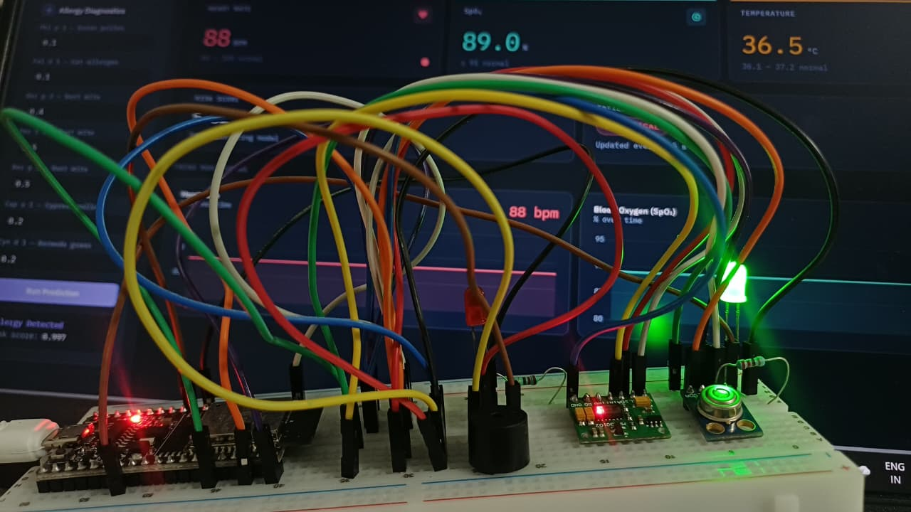

# Hybrid-Monitoring-System-for-Real-Time-Vitals-Analysis-and-Allergy-Risk-Prediction-
A hybrid healthcare intelligence system that combines IoT-based real-time vitals monitoring with ML-based allergy risk prediction, unified in a single web dashboard.
## Overview

Modern healthcare needs both **continuous physiological monitoring** and **predictive diagnostics**. This project bridges that gap with two complementary ML pipelines:

1. **Allergy Risk Prediction (Supervised Learning)**
   Uses IgE antibody reactivity data (256 allergen-specific biomarkers from microarray chip-assay data) to classify allergic vs. non-allergic reactions with a **Random Forest classifier**, achieving an **AUC of 0.988**. Identifies key biomarkers such as `Phl_p_1` (grass pollen), `Fel_d_1` (cat dander), and dust mite proteins (`Der_p_1`, `Der_p_2`, `Der_f_2`).

2. **Real-Time Vitals Monitoring (Unsupervised Learning)**
   Streams live heart rate, SpO₂, and body temperature from an **ESP32 + MAX30102 + MLX90614** hardware setup, and classifies patient state into **Safe / Warning / Critical** using **K-Means clustering** — no labeled data required.

Both modules feed into a single **Flask + Chart.js dashboard** for real-time visualization.

---

## Features

- Random Forest allergy classifier trained on 256-feature IgE chip-assay dataset (AUC 0.988)
- Feature importance analysis to surface clinically significant biomarkers
- Real-time heart rate & SpO₂ via MAX30102, body temperature via MLX90614
- K-Means clustering for unsupervised patient state classification (Safe/Warning/Critical)
- ESP32 ↔ Python backend over UART serial (115200 baud)
- Live web dashboard with interactive charts (Chart.js)
- On-device LED/buzzer alerts on critical risk thresholds

---

## System Architecture

```
┌─────────────────┐     UART (115200)     ┌──────────────────┐
│  ESP32 + Sensors │ ────────────────────▶ │  Flask Backend    │
│  MAX30102/MLX90614│                       │  (Python)         │
└─────────────────┘                        │  - Serial reader   │
                                            │  - K-Means model   │
                                            │  - RF allergy model│
                                            └────────┬──────────┘
                                                     │ REST API
                                                     ▼
                                          ┌────────────────────┐
                                          │  Web Dashboard       │
                                          │  HTML/CSS/JS + Chart.js│
                                          └────────────────────┘
```

**Pipeline stages:** Data Collection → Preprocessing → Model Development → Integration → Dashboard → Evaluation → Testing

---

## Tech Stack

| Layer | Technology |
|---|---|
| Hardware | ESP32, MAX30102 (HR/SpO₂), MLX90614 (IR temperature) |
| Firmware | Arduino/C++ (`esp_task_wdt`, `spo2_algorithm`) |
| Backend | Python, Flask, flask-cors, NumPy, joblib, pyserial |
| ML | scikit-learn (Random Forest, K-Means) |
| Frontend | HTML5, CSS3, JavaScript, Chart.js |
| Datasets | data.gouv.fr (IgE allergen chip-assay), VitalDB (clinical vitals) |

---

---

## Getting Started

### Hardware Setup

ESP32 + MAX30102 + MLX90614 breadboard setup streaming live vitals (88 bpm, 89.0% SpO₂, 36.5°C) to the dashboard in real time.
1. Wire MAX30102 and MLX90614 to ESP32 via I²C (SDA=21, SCL=22).
2. Connect RED_LED, GREEN_LED, and BUZZER to GPIO 25, 4, and 27.
3. Flash `esp32_vitals_monitor.ino` via Arduino IDE.

### Backend Setup
```bash
cd backend
pip install -r requirements.txt
python app.py
```
> Update the `COM7` serial port in `app.py` to match your ESP32's port.

### Frontend
Open `http://localhost:5000` in your browser once the Flask server is running — it serves `index.html` directly.

---

## Results

- **Allergy classifier:** AUC = 0.988 on held-out test data
- **Top biomarkers:** `Phl_p_1`, `Fel_d_1`, `Der_f_2`, `Der_p_1`, `Cyn_d_1`
- **Clustering:** 3 well-separated clusters (Safe/Warning/Critical) via Elbow Method (k=3 optimal)

---

## Future Work

- Larger, more diverse clinical datasets
- Edge-device model optimization (on-ESP32 inference beyond clustering)
- Deep learning models for improved accuracy on complex physiological patterns
- Deployment on wearable form factors

---

## References

Key literature includes work on AI-driven wearable allergy monitoring (Konstantinou et al., 2025), IgE testing advances (Hamilton et al., 2020), and IoT health monitoring systems (Valsalan et al., 2020). 

---
